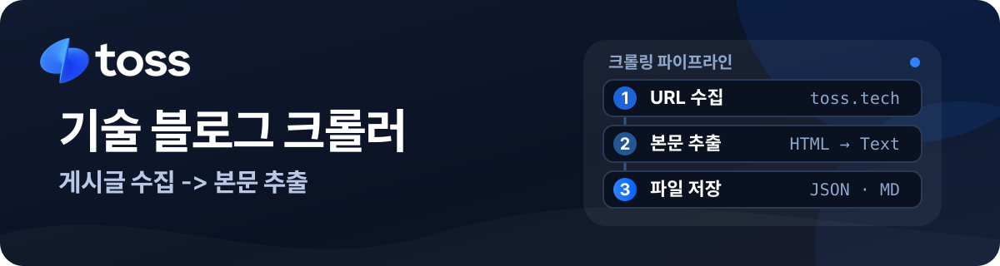

<p align="center">
  
</p>

# Toss Tech Blog Extractor

> 토스 기술 블로그의 공개 게시글 URL을 수집하고, 본문을 JSON과 Markdown으로 변환·저장하는 개인 포트폴리오 프로젝트입니다.

공개 웹 문서를 대상으로 URL 수집, 접근 상태 확인, HTML 파싱, 파일 내보내기까지의 흐름을 Python으로 구현했습니다. 목록 API를 우선 사용하되 사용할 수 없을 때는 HTML 목록 수집으로 전환하며, HTML 구조 변경에 대비해 의미 기반 선택자와 CSS 선택자를 함께 둡니다.

> [!IMPORTANT]
> 이 저장소는 토스 또는 비바리퍼블리카가 운영하거나 후원하는 공식 프로젝트가 아닙니다. `data/`의 텍스트는 공개 웹 페이지에서 수집한 결과일 뿐 원문을 대체하지 않으며, 최신 내용과 맥락은 항상 [토스 기술 블로그](https://toss.tech/)의 원문 링크를 우선 참조하세요. 토스 명칭·로고 등 상표와 게시글의 저작권은 각 권리자에게 있습니다.

## ✨ 주요 기능

| 기능 | 설명 |
| --- | --- |
| 게시글 URL 수집 | 공개 목록 API에서 게시글 URL을 수집하고, 실패 시 HTML 목록 페이지를 순회합니다. |
| URL 정규화·검증 | 중복, 쿼리 문자열, 앵커를 제거하고 수집된 URL의 HTTP 상태를 확인합니다. |
| 본문 추출 | 제목·작성일·본문을 추출해 HTML, 일반 텍스트, Markdown 표현으로 보존합니다. |
| 안정적인 요청 처리 | 동시 연결 수와 제한 시간을 조절하고, 429·5xx·시간 초과에는 지수 백오프로 재시도합니다. |
| 결과 내보내기 | 전체 결과는 JSON으로, 게시글별 결과는 Markdown 파일로 저장합니다. |

## 🧭 설계 방향

- **변경에 견디는 파싱:** 의미 있는 HTML 태그와 메타데이터를 우선 탐색하고, 기존 CSS 선택자는 폴백으로 사용합니다. 사이트의 클래스명이 바뀌어도 기본 정보를 추출할 가능성을 높이기 위한 선택입니다.
- **작업 단계 분리:** URL 수집, 상태 확인, 본문 추출, 파일 저장을 독립 모듈과 CLI 하위 명령으로 나눴습니다. 필요한 단계만 실행하거나 각 단계의 결과를 확인할 수 있습니다.
- **원문 추적성:** JSON 결과에 원문 URL과 수집 시각을 남깁니다. 수집 결과는 특정 시점의 스냅샷이므로 원문을 우선 확인할 수 있게 하기 위함입니다.

## 🛠 기술 스택

| Category | 기술 |
| --- | --- |
| Language | Python 3.12 이상 |
| HTTP & Concurrency | requests, aiohttp, asyncio |
| Parsing | Beautiful Soup 4, markdownify |
| Packaging | uv, Hatchling |
| Testing & Quality | unittest, Ruff, GitHub Actions |

## 📁 프로젝트 구조

```text
toss-tech-blog-extractor/
├── src/toss_tech_blog_extractor/
│   ├── url_collector.py       # 게시글 URL 수집과 HTML 폴백
│   ├── url_checker.py         # 수집 URL의 HTTP 상태 확인
│   ├── article_extractor.py   # 게시글 파싱, 재시도, Markdown 변환
│   ├── exporters.py           # JSON·Markdown 파일 저장
│   ├── selectors.py           # 의미 기반·CSS 폴백 선택자
│   └── cli.py                 # 통합 CLI
├── tests/                     # 네트워크 없는 단위 테스트
├── data/                      # 수집 결과 코퍼스와 실행 결과 저장 위치
├── .github/workflows/ci.yml   # 정적 검사·테스트·패키지 빌드 자동화
├── main.py                    # 패키지 설치 전 실행 가능한 진입점
└── pyproject.toml             # 패키지와 실행 명령 설정
```

## 🚀 시작하기

### 요구 사항

- Python 3.12 이상
- [uv](https://docs.astral.sh/uv/)

### 1. 저장소 내려받기

```bash
git clone https://github.com/jaehunshin-git/toss-tech-blog-extractor.git
cd toss-tech-blog-extractor
```

### 2. 설정하기

잠금 파일 기준으로 의존성을 설치합니다. 별도의 환경 변수나 시크릿은 필요하지 않습니다.

```bash
uv sync --locked
```

### 3. 실행하기

먼저 URL 목록을 수집합니다. 결과는 실행한 날짜가 포함된 이름으로 `data/urls/`에 저장됩니다.

```bash
uv run toss-tech-blog url_crawler
```

생성된 URL 목록의 접근 상태를 확인한 뒤, 목록 파일 경로를 지정해 본문을 추출합니다.

```bash
uv run toss-tech-blog check_urls data/urls/toss_url_MMDD.txt

uv run toss-tech-blog techblog_extractor \
  --input data/urls/toss_url_MMDD.txt \
  --output data/jsons/articles.json \
  --markdown
```

`--markdown`을 지정하면 게시글별 Markdown 파일을 `data/mark_downs/`에 함께 저장합니다. `--concurrent`와 `--timeout`으로 최대 동시 연결 수와 요청 제한 시간(초)을 조절할 수 있습니다.

### 4. 검증하기

네트워크 없이 실행되는 단위 테스트와 정적 검사를 실행합니다. GitHub Actions도 같은 흐름으로 Ruff 검사, 테스트, 패키지 빌드를 수행합니다.

```bash
uv run python -m unittest discover -s tests -v
uv run ruff check .
uv run ruff format --check .
uv build
```

## 📚 문서

### 공개 데이터 안내

`data/jsons/`에는 전체 수집 결과 JSON이, `data/mark_downs/`에는 게시글별 Markdown 결과가 포함되어 있습니다. 이는 크롤러의 실제 출력 형식과 추출 품질을 검토하기 위한 공개 코퍼스이며, 원문을 이 저장소에서 재활용·재배포하기 위한 데이터셋이 아닙니다.

- 각 결과에는 출처 URL과 수집 시각이 포함됩니다.
- 게시글은 수정·삭제될 수 있으므로 최신 정보, 인용, 이용 여부는 반드시 [토스 기술 블로그](https://toss.tech/)의 원문에서 확인해야 합니다.
- 콘텐츠를 서비스에 적용하거나 별도로 이용하기 전에는 해당 권리와 이용 조건을 확인해야 합니다.

## 📌 포트폴리오 범위와 권리 안내

이 프로젝트의 목적은 공개 웹 콘텐츠를 다루는 수집·파싱·변환 파이프라인의 구현을 보여 주는 것입니다. 토스와 제휴하거나 토스의 공식 도구를 제공하는 프로젝트가 아닙니다.

- 배너의 토스 로고는 [토스 브랜드 리소스 센터](https://brand.toss.im/)에서 제공하는 공식 자산을 원형·색상·비율 변경 없이 사용했습니다. 관련 상표권은 비바리퍼블리카에 있습니다.
- 수집 콘텐츠의 저작권은 각 원저작자 또는 권리자에게 있으며, 이 저장소의 수집 결과는 원문과 독립된 권리 허락을 의미하지 않습니다.
- 콘텐츠를 인용하거나 이용할 때는 원문 URL을 함께 제시하고, 상업적 이용·대량 재배포 등은 적용 가능한 이용 조건과 권리를 별도로 확인하세요.
